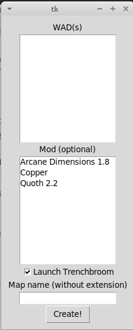

### Quake Scripts

#### Python scripts for automating Quake 1 level design tasks

**Makemap GUI** - this utility reduces clicks needed to start a new Quake 1 mapping project using [TrenchBroom](https://kristianduske.com/trenchbroom/). It should be placed in the same folder as Trenchbroom. If textures are in a separate folder, this should be set at line 14, and the desired output folder should be set at line 12. This utility assumes the FGD files for Arcane Dimensions 1.8, Copper, and Quoth 2.2, are in the Trenchbroom folder too. You can change this list at line 67.

Makemap GUI has the following dependencies:

- Python (tested on Python 3.8.0)
- [TrenchBroom](https://kristianduske.com/trenchbroom/), the excellent modern Quake map editor
- these Python packages which can be installed using [pip](https://pypi.org/project/pip/):
  - tkinter
  - vgio ([Joshua Skelton's library](http://joshuaskelton.com/projects/vgio/) for accessing and processing Quake (and other game) file formats)

</img>

**Temple-maker** - see README.md in the ```temple-maker``` subdirectory of this repo

**Arch** - see README.md in the ```arch``` subdirectory of this repo

Kevin Higgins, 05/05/21