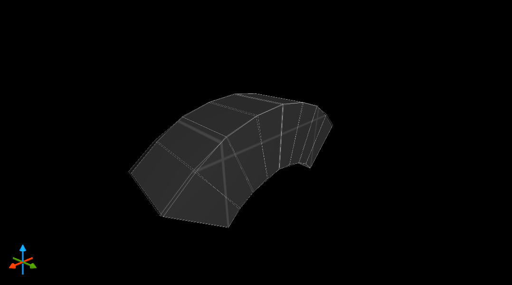

### Arch

#### Romanesque arch generator for Quake 1

This Python script automates the creation of arch-shaped level geometry, saved in the .MAP text-based format for Quake 1 game levels. 

This script has the following dependencies:

- Python (tested on Python 3.8.0)

- vgio ([Joshua Skelton's Python package](http://joshuaskelton.com/projects/vgio/) for accessing and processing Quake (and other game) file formats)

The arch proportions and shape can be specified with command-line parameters. Full-length or abbreviated parameters may be used, as shown:

```shell
--sides <no. of sides> --width <width> --triangles --fractional --angle <segment angle> --name <map filename> --ring <ring thickness> --help
-s <no. of sides> -w <width> -t -f -a <segment angle> -n <map filename> -r <ring thickness> -h
```

Here are some example outputs, as rendered by [TrenchBroom](https://kristianduske.com/trenchbroom/), the awesome Quake 1 mapping application.

```shell
python arch.py --name demoarch1 --angle 150 --width 256 --sides 11
```


The ```triangles``` parameter creates slightly more efficient geometry. This is similar to the arches generated by Valve's Worldcraft 3.3 map editor for Half-Life (although they didn't have the bilateral symmetry). Note that, if you are using integer coordinates (the default), it is the inner points of the arch (on the *infrados*) that are rounded to integers, not the outer edges of the triangles.

```shell
python arch.py --name demoarch2 --triangles
```


The ```ring``` parameter causes the outer part of the arch (the *extrados*) to be curved rather than a rectilinear block. How pretty!

```shell
python arch.py -n demoarch3 -w 32 -a 90 -r 16 -s 8
```


But, you might have noticed that the arch above has a wonky curve underneath. That is because it's only 32 units wide and the effect of the integer rounding is noticeable.

So here I overlay two arches which differ only in that the second has the ```fractional``` parameter applied, meaning its coords are stored as floating point numbers instead of integers.

```shell
python arch.py -n demoarch4 -w 32 -a 90 -r 16 -s 8 -f
```



Shout out to the Quake community still at it 25 years later.

Kevin Higgins, 31/12/20